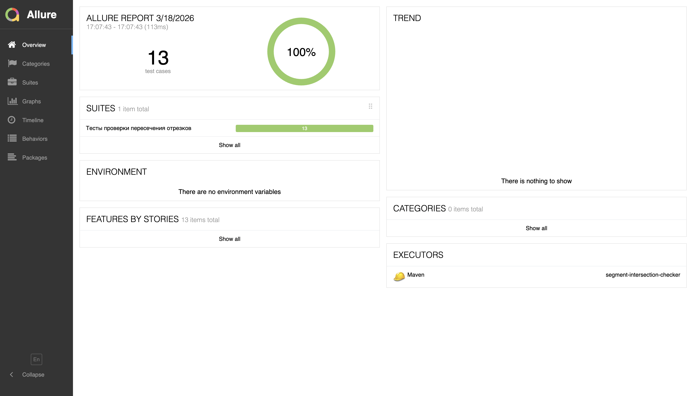
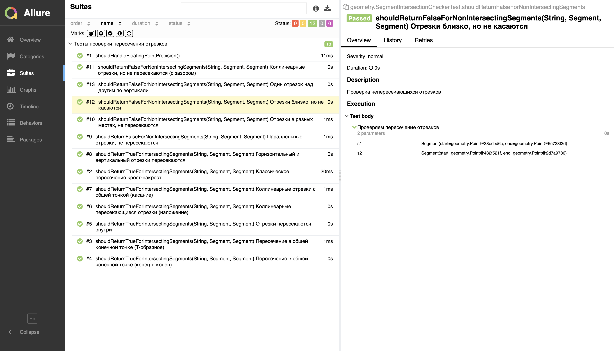

# segment-intersection-checker
### Стек: 

- Java 22
- Maven
- JUnit 5
- Allure Report

Инструмент для проверки пересечения двух отрезков. Включает реализацию и тесты.

Отрезки задаются координатами:
(x1, y1), (x2, y2) и (x3, y3), (x4, y4)
Пересечение — наличие хотя бы одной общей точки.

В тестах использовал @MethodSource от JUnit5, чтобы:
- централизовать тестовые данные
- легко добавлять новые кейсы
- сделать тесты читаемыми через описание

## Как запустить проект

### Сборка проекта
```bash
mvn clean package
```

### Запуск приложения
```bash
java -jar target/segment-intersection-checker-1.0-SNAPSHOT.jar
```
Получим сообщение в консоли
```
Используются координаты по умолчанию
Segments intersect: true
```

### Запуск тестов

```bash
mvn clean test
```

### Allure отчет

#### Генерация отчета

```bash
mvn allure:report
```

#### Открытие отчета

```bash
mvn allure:serve
```

### Реализация

Используется классический алгоритм:
Векторное произведение (orientation / direction)

Проверка общего случая пересечения

Обработка коллинеарных случаев

###  Тестовое покрытие

Покрыты сценарии:

- Классическое пересечение (крест-накрест)
- Пересечение в одной точке (T-образное, конец-в-конец)
- Пересечение внутри отрезков
- Коллинеарные случаи:
    - наложение
    - касание
    - отсутствие пересечения
- Параллельные отрезки
- Перпендикулярные отрезки
- Геометрически разнесённые отрезки

Таким образом покрыл все основные классы:
- общий случай пересечения
- граничные случаи (касание, коллинеарность)
- отрицательные сценарии

#### Скрин из Allure отчета:



